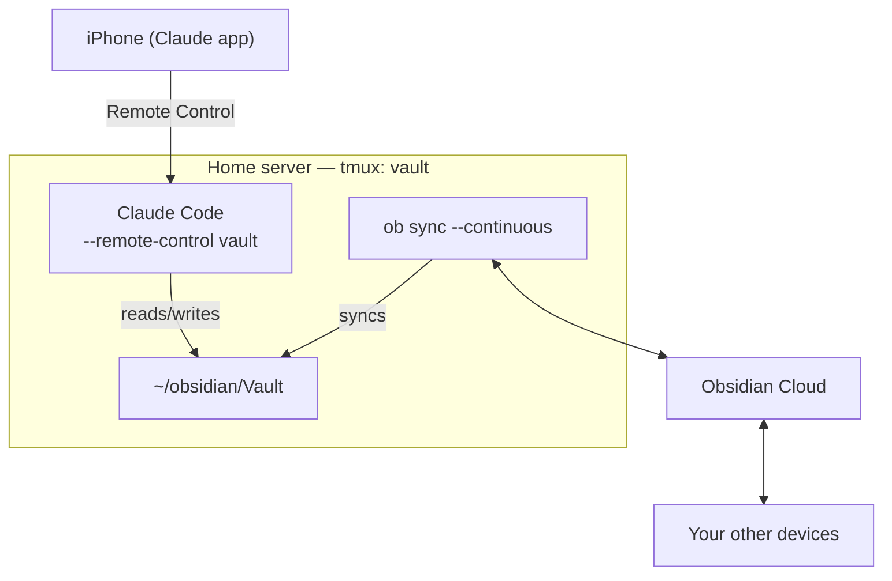

This guide walks through setting up an Obsidian vault on a home computer (like a Raspberry Pi) so that Claude Code can read and edit it remotely — letting you manage your notes, ask questions about your vault, and create or update notes by talking to Claude from any machine.

The end result: your vault lives on a home server, stays in sync via Obsidian Sync, and Claude Code runs directly inside the vault directory so you can treat your notes as a tool-accessible knowledge base.

---

## How It Works



Obsidian Sync and Claude Code run persistently in a tmux session. Your phone connects to the Claude Code window via Remote Control — you issue commands and get responses as if you were sitting at the machine.

No firewall changes or port forwarding needed. Remote Control makes outbound HTTPS requests only and never opens inbound ports — your home server phones home through the Anthropic API, and your iPhone connects through the same channel. ([Source](https://docs.anthropic.com/en/docs/claude-code/remote-control))

---

## What You'll Need

- A computer running Linux (Raspberry Pi, old laptop, home server — anything with a stable network connection)
- An [Obsidian Sync](https://obsidian.md/sync) subscription (required for headless sync)

---

## Step 1: Install Node.js via NVM

Claude Code and the Obsidian headless sync tool both require Node.js. Install it via NVM so you can manage versions cleanly.

```bash
curl -o- https://raw.githubusercontent.com/nvm-sh/nvm/v0.40.4/install.sh | bash
```

Restart your shell (or `source ~/.bashrc`), then install Node 24:

```bash
nvm install 24
```

Verify:

```bash
node --version   # should print v24.x.x
```

---

## Step 2: Install Claude Code

```bash
npm install -g @anthropic-ai/claude-code
```

Then authenticate:

```bash
claude
```

Follow the prompts to log in with your Anthropic account.

---

## Step 3: Create a Working Directory

Create a dedicated directory that will serve as both the vault and the place you launch Claude Code from.

```bash
mkdir -p ~/obsidian/Vault
cd ~/obsidian/Vault
```

Obsidian Sync works on the directory itself — it syncs vault contents directly into whatever folder you point it at. This same directory is where you'll launch Claude Code.

---

## Step 4: Set Up Obsidian Sync (Headless)

The `obsidian-headless` package lets a Linux server sync your Obsidian vault without the Obsidian desktop app running — no GUI needed.

### Install the headless client

```bash
npm install -g obsidian-headless
```

### Log in to Obsidian Sync

```bash
ob login
```

This opens an OAuth flow in your browser. Complete it on your workstation if the server has no display — the login URL will be printed to the terminal.

### Find and connect your vault

List your remote vaults to get the vault name:

```bash
ob sync-list-remote
```

Example output:

```
Vaults:
  01234abc  "Vault"  (North America)
```

Run `sync-setup` from inside the vault directory you just created:

```bash
cd ~/obsidian/Vault
ob sync-setup --vault Vault
```

### Do an initial sync

```bash
ob sync
```

---

## Step 5: Set Up tmux and Launch Everything

Install tmux if it isn't already available:

```bash
sudo apt install tmux
```

Navigate to the vault directory and start a new named session:

```bash
cd ~/obsidian/Vault
tmux new-session -s vault
```

In the first window, rename it to `sync` and start Obsidian's continuous sync:

```
Ctrl-b ,   → type: sync
```

```bash
ob sync --continuous
```

Open a second window, rename it to `claude`, and launch Claude Code with remote control:

```
Ctrl-b c
Ctrl-b ,   → type: claude
```

```bash
claude remote-control --name vault
```

To reconnect after logging out:

```bash
tmux attach -t vault
```

### Connect from iOS

Open the Claude app on your iPhone, tap **Code** in the navigation bar, and find the `vault` session in the list — it shows a computer icon with a green dot when online. Tap it to connect — you're now controlling Claude Code on your home server from your phone.

---

## What You Can Do with This

Once set up, Claude Code has full read/write access to your vault. Some things that work well:

- **Search and retrieve**: "Find all my notes tagged #recipe and summarize them"
- **Create notes**: "Add a new note in Projects/Travel for my Japan trip with a packing list"
- **Edit existing notes**: "Update my reading list to mark Thinking Fast and Slow as done"
- **Cross-note analysis**: "What's the common thread across my meeting notes from last month?"
- **Filing inbox items**: "Take the unsorted notes in Inbox and file them in the right folders"

The vault is just a folder of markdown files — Claude Code reads and writes them like any other file, with full awareness of Obsidian conventions like wikilinks and frontmatter.
